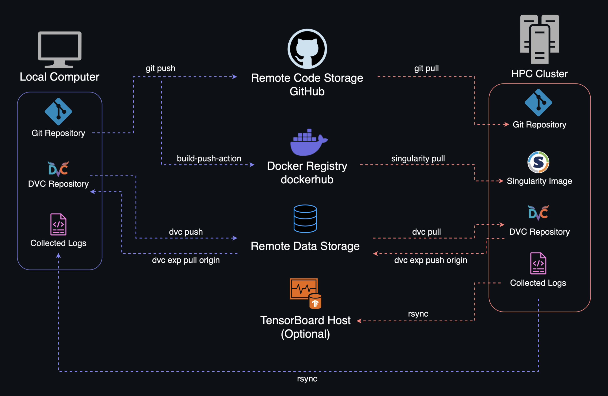

# HPC-Cluster-ML-Workflow 

This template provides a structured workflow designed for audio machine learning research on the [HPC Cluster of ZECM at TU Berlin](https://www.tu.berlin/campusmanagement/angebot/high-performance-computing-hpc). Aiming at projects that require ongoing management of multiple experiments over extended periods, this setup ensures high reproducibility of results. By integrating tools like DVC, Docker, and TensorBoard, it establishes a robust framework for effectively training, monitoring and versioning machine learning experiments.

## Features
- **Reproducible Experiments**: 
  - Enables the reproduction of models and artifacts through comprehensive versioning of dependencies, pipeline definitions, and artifacts.
  - Ensures consistent and repeatable results across different systems through containerized execution environments. 
- **Resource Optimization**: Enhances efficiency by skipping unnecessary stage executions across experiments, leveraging a shared cache to reuse data.
- **Automation**: Streamlines workflows for builds, data pipelines, parallel execution, and remote syncing, reducing manual intervention and enhancing productivity.
- **HPC Integration**: 
   - Extends DVC's native single-node parallel execution capabilities with a custom implementation that enables parallel DVC experiments across multiple nodes.
   - Utilizes Singularity's Docker support to facilitate convenient image conversion, simplifying the creation and deployment of Singularity images in the HPC cluster.
- **Tensorboard Integration**: Provides a comprehensive overview of DVC experiments within TensorBoard, enabling comparison and analysis of results, augmented by TensorBoard's capability to log audio samples.
- **Real-time Monitoring**: Offers live tracking and visualization of experiment metrics, facilitating immediate insights and enabling the quick termination of flawed experiments.

## Overview

The table below summarizes the key tools involved in the HPC-Cluster-ML-Workflow, detailing their primary roles within the workflow and providing links to their official documentation for further reference.

<table align="center" style="width: 60%; border-collapse: collapse;">
  <tr>
    <th>Tool</th>
    <th>Role</th>
    <th>Documentation</th>
  </tr>
  <tr>
    <td><b>Git</b></td>
    <td>Version control for code and configuration management.</td>
    <td><a href="https://git-scm.com/doc">Git Docs</a></td>
  </tr>
  <tr>
    <td><b>DVC</b></td>
    <td>Data version control and pipeline management.</td>
    <td><a href="https://dvc.org/doc">DVC Docs</a></td>
  </tr>
  <tr>
    <td><b>TensorBoard</b></td>
    <td>ML experiment visualization and monitoring.</td>
    <td><a href="https://www.tensorflow.org/tensorboard">TensorBoard Docs</a></td>
  </tr>
  <tr>
    <td><b>Docker</b></td>
    <td>Containerization tool, used for conversion to Singularity images.</td>
    <td><a href="https://docs.docker.com">Docker Docs</a></td>
  </tr>
  <tr>
    <td><b>Singularity</b></td>
    <td>HPC-compatible containerization tool.</td>
    <td><a href="https://docs.sylabs.io">Singularity Docs</a></td>
  </tr>
  <tr>
    <td><b>SLURM</b></td>
    <td>Job scheduling and workload management on the HPC-Cluster.</td>
    <td><a href="https://slurm.schedmd.com/documentation.html">SLURM Docs</a></td>
  </tr>
</table>

### System Transfer
The figure below offers a simplified overview of how data is transferred between systems in this workflow. While some of the commands depicted are automated through the provided scripts, the visualization is intended for comprehension and not as a direct usage reference.
        

        
        

## Prerequisites
- macOS or Linux operating system.
- Access to the HPC Cluster.
- Local Python installation.
- Familiarity with Git, DVC, and Docker.
- Docker Hub account.

## Setup and Usage

This template provides a simple PyTorch example project, simulating a neural guitar amp, which you can modify and reuse or use as a reference for the pipeline implementation. 

- [Setup Instructions](docs/SETUP.md)
- [User Guide](docs/USAGE.md)

## Contributors

- [Michael Witte](https://github.com/michaelwitte)
- [Fares Schulz](https://github.com/faressc)

## License

This project is licensed under the terms of the [MIT License](LICENSE.md). 

## References

**Faressc. (n.d.). *Guitar LSTM* [pytorch-version]. GitHub. [Link](https://github.com/faressc/GuitarLSTM/tree/main/pytorch-version)**

